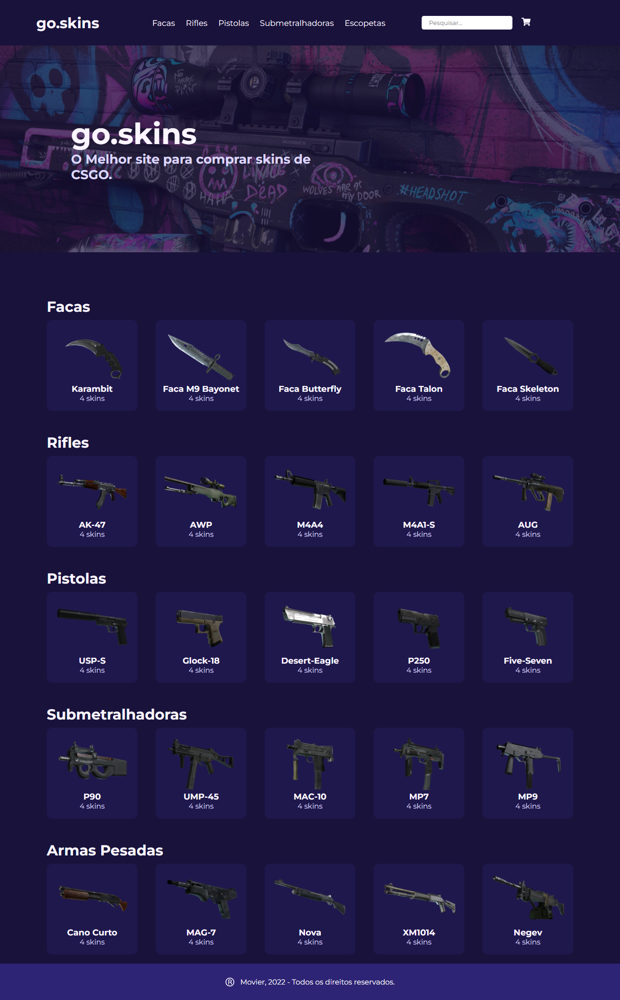

# E-Commerce Redux Vem Ser 

# Time
- <a href="https://github.com/Oliveiralucass">Lucas de Oliveira</a> 
- <a href="https://github.com/YuriAtzler">Yuri Atzler</a> 

# Como rodar o projeto localmente
- Clone ou baixe o repositório
- ### `npm i`
- ### `npm start`

# Como rodar o projeto no vercel

- Acesse o link no canto superior direito (e-commerce-redux-kappa.vercel.app)
- Uma nova página será aberta executando o projeto no navegador
